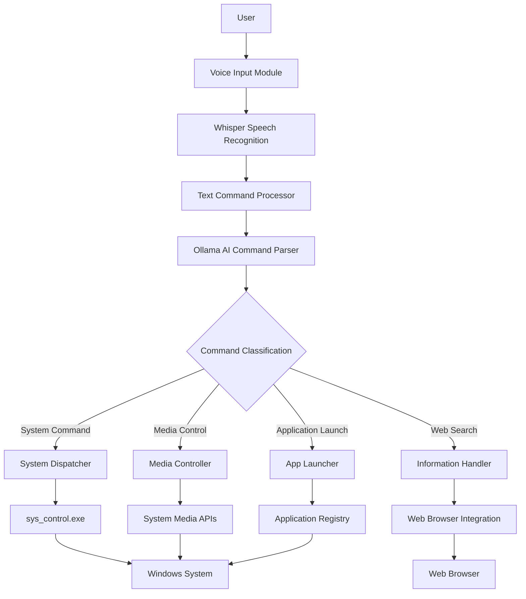
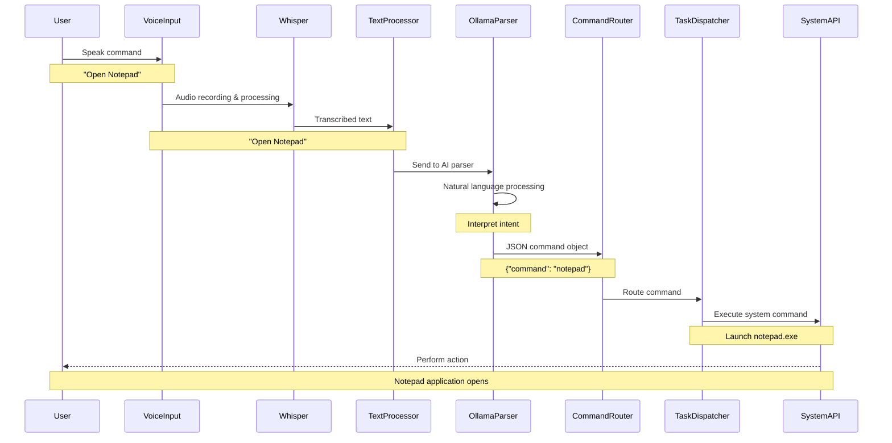

# Voice Assistant

An AI-powered voice assistant for Windows that can control your system, launch applications, search the web, and more - all through voice commands.

## Tech Stack


## Key Technologies

- **Python 3.x**: Core programming language for the main application logic
- **Whisper AI**: Advanced speech-to-text recognition for accurate voice input processing
- **Ollama/Mistral**: Local natural language processing for intelligent command interpretation
- **C++**: High-performance system command execution helper for direct Windows API access
- **Windows API**: Native system integration for seamless Windows command execution

## System Architecture

The voice assistant follows a modular architecture with clearly defined components:



## Data Flow Process

The complete data flow from voice input to system action:



## Features

### 🎙️ Voice Control
- **Speech-to-Text**: High-accuracy voice recognition using OpenAI Whisper
- **Natural Language Processing**: Intuitive command understanding with Mistral AI
- **Hands-Free Operation**: Complete system control without keyboard or mouse
- **Continuous Listening**: Always-ready voice activation

### 💻 System Commands
- **Application Launch**: Open any installed application with voice commands
- **System Controls**: Shutdown, restart, lock screen, and sleep mode
- **File Operations**: Open file explorer, launch specific files
- **System Settings**: Direct access to Windows settings panels

### 🔍 Web Search & Information
- **Intelligent Search**: AI-powered search query optimization
- **Browser Integration**: Direct browser launching with search terms
- **Information Queries**: Ask questions and get relevant web results
- **Knowledge Access**: Retrieve information on any topic

### 🎵 Media Control
- **Playback Control**: Play, pause, stop, next, and previous track
- **Volume Management**: Increase, decrease, and mute system volume
- **Media Applications**: Launch music and video players
- **Screenshot Capture**: One-command screen capture

### ⚙️ Advanced Features
- **Customizable Phrases**: Personalize activation and stop phrases
- **Configurable Settings**: Adjust audio, AI, and system preferences
- **Error Recovery**: Intelligent error handling and fallback mechanisms
- **Extensible Design**: Easy to add new commands and features

## Installation

### Prerequisites

1. **Python 3.8+**
   - Download from [python.org](https://www.python.org/downloads/)
   - Ensure pip is installed and updated

2. **Ollama with Mistral Model**
   ```bash
   # Install Ollama from https://ollama.com/download
   # Then pull the required model:
   ollama run mistral:7b-instruct-q4_K_M
   ```

3. **Whisper Model Dependencies**
   ```bash
   pip install openai-whisper
   pip install sounddevice
   pip install numpy
   ```

4. **Visual Studio or MinGW** (for C++ components)
   - Required to compile the system control helper

### Python Dependencies

Install all required Python packages:

```bash
pip install openai-whisper
pip install sounddevice
pip install numpy
pip install tkinter  # Usually included with Python
```

### Build C++ Helper

Compile the system control helper:

```bash
# Using g++ (MinGW)
g++ -o build/sys_control.exe sys_control.cpp

# Using Visual Studio
cl /EHsc sys_control.cpp /Fe:build/sys_control.exe
```

## Usage

### Starting the Assistant

1. Run the main application:
   ```bash
   python main.py
   ```

2. Wait for the activation prompt:
   ```
   🎤 Say 'Hello Assistant' to start...
   ```

3. Activate with any configured phrase:
   - "Hello Assistant"
   - "Hey Assistant"
   - "Ok Assistant"

### Voice Commands

#### System Commands
| Voice Command | Action |
|---------------|--------|
| "Open Notepad" | Launches Notepad text editor |
| "Shutdown my PC" | Shuts down the computer immediately |
| "Restart my computer" | Restarts the computer |
| "Lock screen" | Locks the current user session |
| "Open calculator" | Launches Windows Calculator |
| "Open file explorer" | Opens Windows File Explorer |
| "Take screenshot" | Captures screen image to clipboard |

#### Media Controls
| Voice Command | Action |
|---------------|--------|
| "Play music" | Opens YouTube with music playlist |
| "Pause music" | Sends pause command to active media player |
| "Next track" | Skips to next song in playlist |
| "Previous track" | Returns to previous song in playlist |
| "Increase volume" | Raises system volume by 10% |
| "Decrease volume" | Lowers system volume by 10% |
| "Mute system volume" | Toggles system mute state |

#### Web Search
| Voice Command | Action |
|---------------|--------|
| "What is artificial intelligence?" | Searches for AI definition |
| "Who is the president of USA?" | Searches for current US president |
| "How to cook pasta?" | Searches cooking instructions |
| "Weather today" | Searches for current weather |
| "Define quantum computing" | Searches for definition |

#### Application Launch
| Voice Command | Action |
|---------------|--------|
| "Launch Chrome" | Opens Google Chrome browser |
| "Start Excel" | Opens Microsoft Excel |
| "Open VS Code" | Opens Visual Studio Code |
| "Launch Spotify" | Opens Spotify music application |
| "Start PyCharm" | Opens PyCharm IDE |

### Advanced Usage

#### Long Commands
For complex instructions, use:
- "Long command" - Activates extended listening mode (10 seconds)
- "Complex command" - Same as long command

#### Configuration
Customize the assistant through `config.py`:
- Adjust recording durations
- Modify activation phrases
- Add new application mappings
- Change system command shortcuts

## Command Processing Pipeline


## Project Structure

```tree
voice-assist/
├── main.py                 # Entry point and main loop
├── voice_input.py          # Speech recognition and audio processing
├── ollama_parser.py        # AI command parsing and interpretation
├── task_dispatcher.py      # Command execution and system integration
├── info_handler.py         # Information queries and web search
├── config.py               # Configuration settings and mappings
├── sys_control.cpp         # C++ system command helper
├── build/
│   └── sys_control.exe     # Compiled C++ helper executable
├── README.md               # This documentation file
└── requirements.txt        # Python dependencies list
```

## Configuration Options

The assistant can be extensively customized through `config.py`:

### Audio Settings
```python
DEFAULT_RECORDING_DURATION = 3   # Standard command listening time
LONG_COMMAND_DURATION = 10       # Extended command listening time
```

### AI Model Settings
```python
WHISPER_MODEL = "medium"         # Whisper model size (tiny/base/small/medium/large)
WHISPER_DEVICE = "cuda"          # Processing device (cpu/cuda)
OLLAMA_MODEL = "mistral:7b-instruct-q4_K_M"
```

### Application Mappings
```python
APPLICATION_COMMANDS = {
    "notepad": "notepad",
    "calculator": "calc",
    "chrome": "start chrome",
    "vscode": "start code"
}
```

### Activation Phrases
```python
ACTIVATION_PHRASES = ["hello assistant", "hey assistant", "ok assistant"]
STOP_PHRASES = ["stop assistant", "quit assistant", "exit assistant"]
```

## Error Handling & Recovery

The system implements comprehensive error handling:

### Audio Processing Errors
- Microphone access issues
- Audio recording failures
- Whisper processing timeouts

### AI Parsing Errors
- Invalid JSON responses
- Model unavailability
- Parsing timeouts

### Command Execution Errors
- Application not found
- Permission denied
- System API failures

### Recovery Mechanisms
- Graceful fallbacks for critical failures
- User-friendly error messages
- Automatic retry for transient issues

## Performance Optimization

### Response Time Optimization
- Quick command detection for short phrases
- Parallel processing where possible
- Efficient Whisper model selection

### Resource Management
- Memory-efficient audio processing
- Proper file handle cleanup
- Optimized AI model usage

## Security Considerations

### Privacy Protection
- All processing done locally (no cloud dependencies)
- Audio recordings are temporary and deleted immediately
- No data collection or transmission

### System Access
- Limited to user-level system commands
- No administrative privileges required
- Secure command validation

## Contributing

### Development Setup
1. Fork the repository
2. Create a feature branch
3. Install dependencies
4. Make your changes
5. Test thoroughly
6. Submit a pull request

### Code Standards
- Follow PEP 8 Python style guide
- Include docstrings for all functions
- Write clear, descriptive commit messages
- Add tests for new functionality

### Testing
- Unit tests for core modules
- Integration tests for command flow
- Manual testing for voice commands

## Troubleshooting

### Common Issues

#### Whisper Model Not Loading
```
Error: Failed to load Whisper model
Solution: Check internet connection and try reinstalling openai-whisper
```

#### Ollama Connection Failed
```
Error: Cannot connect to Ollama service
Solution: Ensure Ollama is running and the model is downloaded
```

#### C++ Helper Not Found
```
Error: sys_control.exe not found
Solution: Compile the C++ helper using the provided instructions
```

#### Microphone Access Denied
```
Error: Cannot access microphone
Solution: Check microphone permissions in Windows settings
```

## License

This project is licensed under the MIT License - see the LICENSE file for details.

## Acknowledgments

- [OpenAI Whisper](https://github.com/openai/whisper) for state-of-the-art speech recognition
- [Ollama](https://ollama.com) for easy local AI model deployment
- [Mistral AI](https://mistral.ai) for powerful language understanding
- Windows API documentation and community resources

## Future Enhancements

### Planned Features
- Multi-language support
- Custom voice training
- Advanced context awareness
- Smart home device integration
- Calendar and scheduling integration
- Email and messaging capabilities

### Performance Improvements
- Faster command processing
- Reduced memory footprint
- Enhanced accuracy for noisy environments
- Better handling of accents and dialects